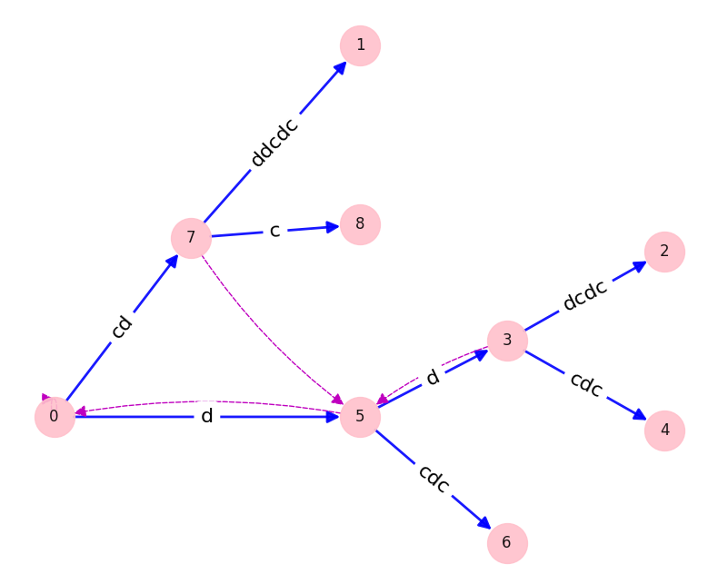

# Ukkonen's Algorithm: Linear Time Suffix Tree Construction
This project implements [Ukkonen's algorithm](https://en.wikipedia.org/wiki/Ukkonen%27s_algorithm)
for linear time suffix tree construction, as described by Gusfield in 
"Algorithms on Strings, Trees, and Sequences: Computer Science and Computational Biology".


## Quickstart
[Setup and activate a virtual python environment](https://packaging.python.org/en/latest/guides/installing-using-pip-and-virtual-environments/), then install requirements.
```
pip3 install -r requirements.txt
```

Then to build and visualize a suffix tree:
```bash
python3 src/suffix_tree.py "cdddcdc"
```
<p>
  
</p>

## Learning thoughts
To learn the algorithm, I browsed a few presentations and then read [this highly recommended StackOverflow thread](https://stackoverflow.com/questions/9452701/ukkonens-suffix-tree-algorithm-in-plain-english). It was helpful in building intuition and I liked that some of the key tricks were introduced early. However, the amendments to the rules across multiple answers left me wanting more rigour. Rigour in describing where the rules came from, and in proving correctness and time complexity.

For this I consulted Dan Gusfield's celebrated book on strings and sequence analysis, which broke down the algorithm fantastically. It starts with a naive algorithm and optimizes it to linear time with proofs along the way. I decided to implement their description of the algorithm following the same incremental process
([1](https://github.com/quintinm-dev/suffix-tree/pull/1),
 [2](https://github.com/quintinm-dev/suffix-tree/pull/2),
 [3](https://github.com/quintinm-dev/suffix-tree/pull/3)).
I think this made it easier as I had smaller chunks to work on and regression test against. I did deviate by using edge compression in the naive algorithm, and I borrowed the concept of an "active point" from the StackOverflow description to represent the current position in the tree.

## Additional resources
In addition to Gusfield's book and the StackOverflow post, I found these resources helpful:
- [Ukkonen algorithm visualizer](https://brenden.github.io/ukkonen-animation/)
    - Extremely helpful to build intuition and trace bugs
    - Note that it's missing internal suffix links to nodes created in prior phases, as described in __Observation 3__ [here](https://stackoverflow.com/a/14580102) using example `cdddcdc`
- https://github.com/baratgabor/SuffixTree
    - Good discussion of rescanning vs suffix links
- https://github.com/shysaur/shysaur-suffixtrees
    - Additional resource recommendations, and a disrecommendation that I think has merit
## Points that I found tricky when reading Gusfield's description

### Single extension algorithm (SEA)
- The accepted StackOverflow answer says that when we split an edge and create a new internal node s(v), we create a suffix link from v to s(v) where v is an internal node created in the previous extension. As noted in the follow-ups, this is incomplete. We always need to create a suffix link from v to s(v), even when s(v) already existed prior to this extension.

### Single phase algorithm (SPA)
- Explicit extension refers to actually visiting the end of _β_, i.e. s[i] when extending to s[i+1]. It does not refer to rule 2 extensions.
- "Observation 2: Once a leaf, always a leaf" relies on the fact that any extension where rule 2 applies is guaranteed to have rule 1 apply in the next phase, as you've introduced a new leaf.
- The SPA requires you to move the active point at the end of a phase
    - In both the O(n^2) and O(n) overall algorithms, the first extension of a phase is done in constant time without any edge walking
     to find the insertion point.
    - Within a phase, the SEA assumes that at the beginning of an extension the active point is unchanged from where the previous extension took place. That is, after extension j-1 of phase i+1 which ensures s[j-1..i+1], extension j assumes the active point is at the end of s[j-1..i].
    - Across phases, the SPA requires that for the first explicit extension the active point is at the end of the last explicit extension of the previous phase. That is, if phase i+1 has last explicit extension k ensuring s[k..i+1], then the first extension of phase i+2 assumes the active point is at the end of s[k..i+1], not s[k..i].
    - In contrast, the original O(n^2) version using just the SEA has an easier cross-phase adjustment of the active point, which is always set to the first leaf.
- If none of the extensions k..i in a phase are rule 3, it's easier to start the next phase with extension i, instead of extension i+1. The repeated explicit extension of extension i isn't necessary, but it lets you treat this case identically to if rule 3 had applied.
## Misc commands 
### Run tests
```bash
python3 -m unittest tests.suffix_tree_test
```
### Lint
```bash
black -l 80 **/*.py
pylint --rcfile=pylintrc **/*.py
```
